# 🌍 SmartTrip AI Planner

> AI-powered travel planning system that generates intelligent itineraries, budgets, routes, blogs, and vlogs using LLMs.

---

## ✨ Overview

SmartTrip AI Planner is a full-stack intelligent travel assistant designed to simplify trip planning using **AI + real-world data APIs**.

It allows users to generate complete travel plans including itinerary, budget, maps, weather insights, and even AI-generated blogs and vlogs.

---

## 🚀 Key Features

- 🧠 AI-generated day-wise itinerary  
- 🗺️ Interactive route visualization (Leaflet + OpenStreetMap)  
- 💰 Budget breakdown (transport, food, stay, misc)  
- 🌦️ Weather insights  
- 📝 AI-powered blog generation  
- 🎥 AI vlog script generation from images  
- 👥 Multi-user trip collaboration  
- 🔐 Secure authentication & access control  

---

## 🧩 System Architecture
User (Next.js Frontend)
↓
Next.js API Routes (Backend Layer)
↓
FastAPI Python Server (AI Engine)
↓
Groq LLM (LLaMA 3)
↓
External APIs (Maps, Weather, Overpass)
↓
PostgreSQL Database (Prisma ORM)

---

## 🛠️ Tech Stack

| Layer        | Technology |
|-------------|-----------|
| Frontend     | Next.js, React, Tailwind CSS |
| Backend      | Next.js API Routes |
| AI Engine    | FastAPI, LangChain, Groq (LLaMA 3) |
| Database     | PostgreSQL (Prisma ORM) |
| Maps         | Leaflet, OpenStreetMap |
| APIs         | Weather API, Overpass API |

---

## 📸 Application Screenshots

### 🏠 Homepage
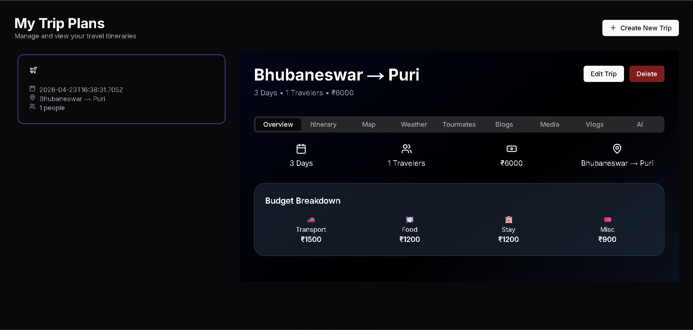

### 🔐 Login Page


### 🧠 Generate Trip
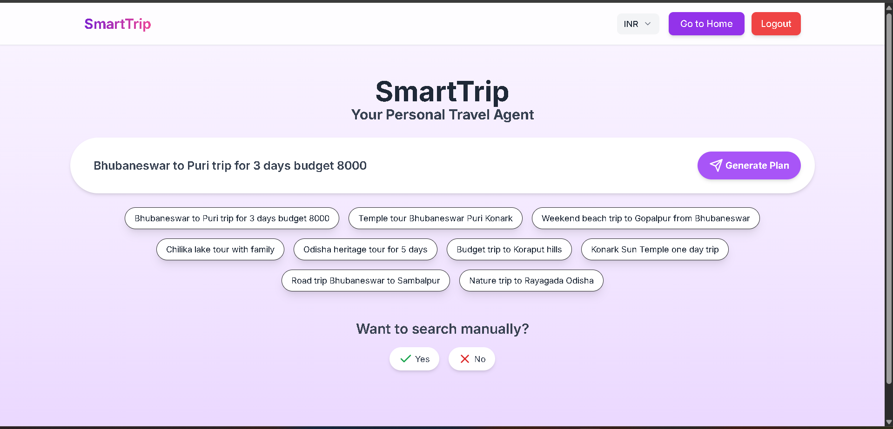

### 📅 Itinerary (Part 1)
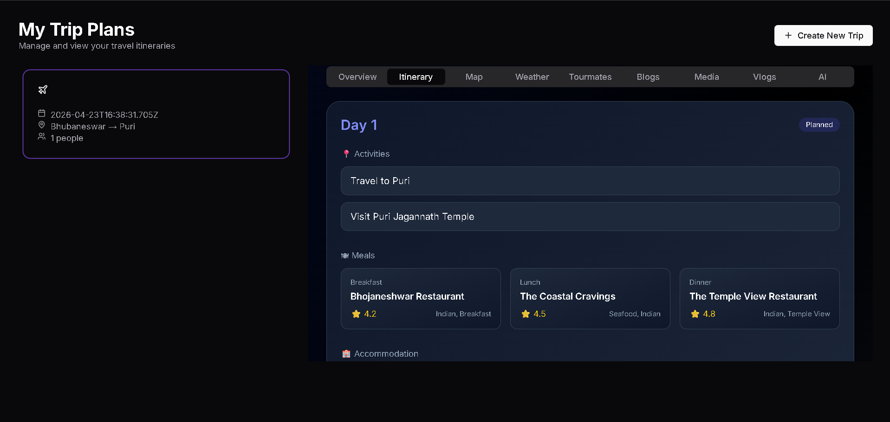

### 📅 Itinerary (Part 2)
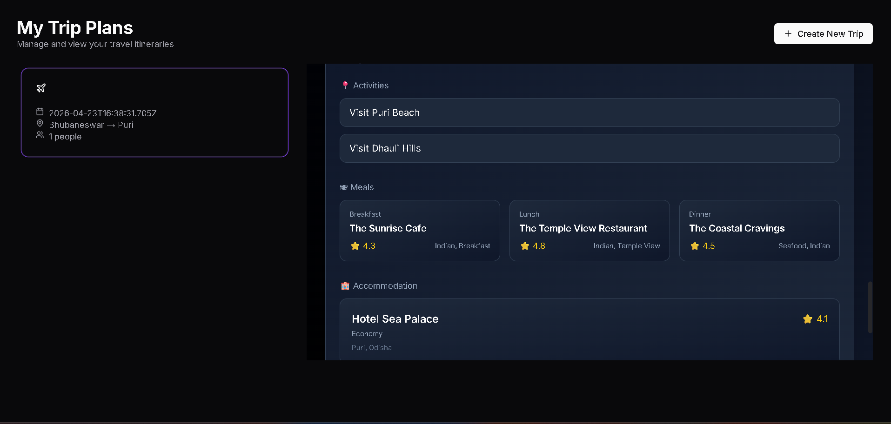

### 🗺️ Map View
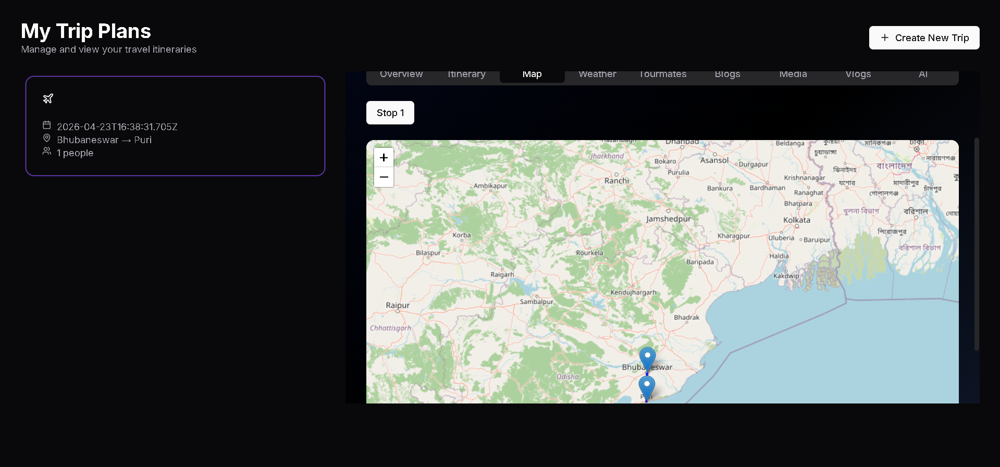

### 🌦️ Weather
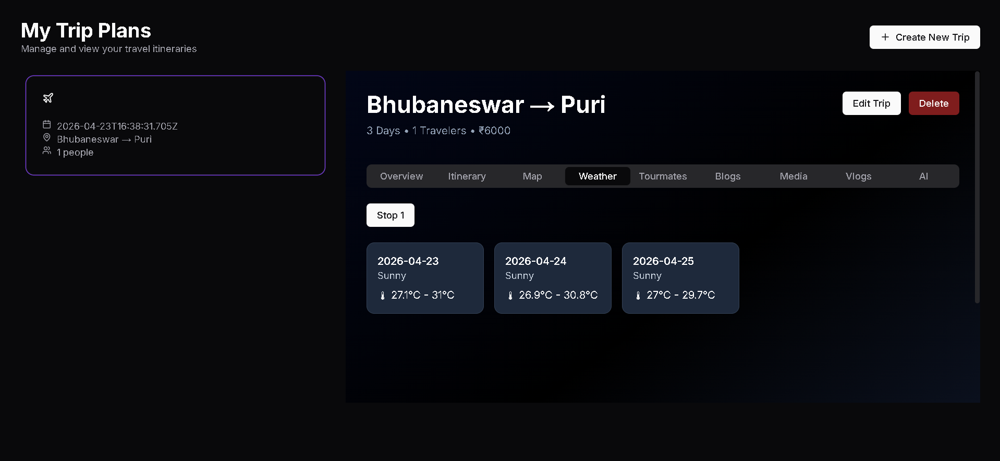

### 👥 Tour Mates
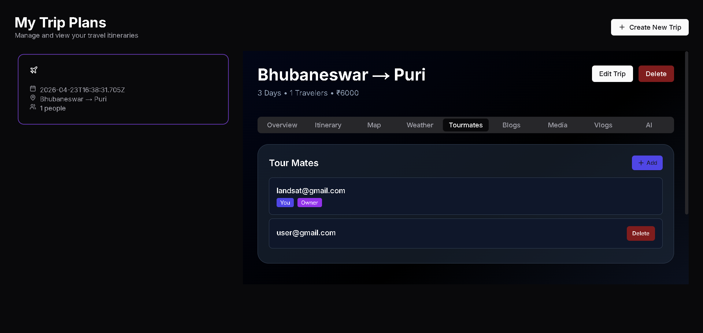

### 🍽️ Dining, Accommodation & Map
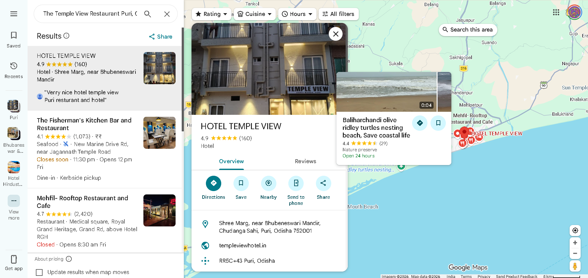

### 📝 Blog Generation
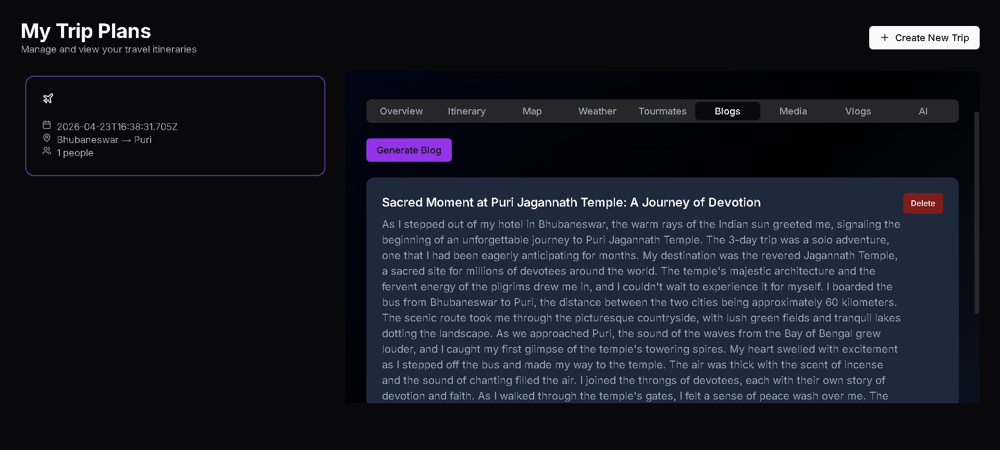

### 🎥 Travel Vlogs


### 📸 Trip Media
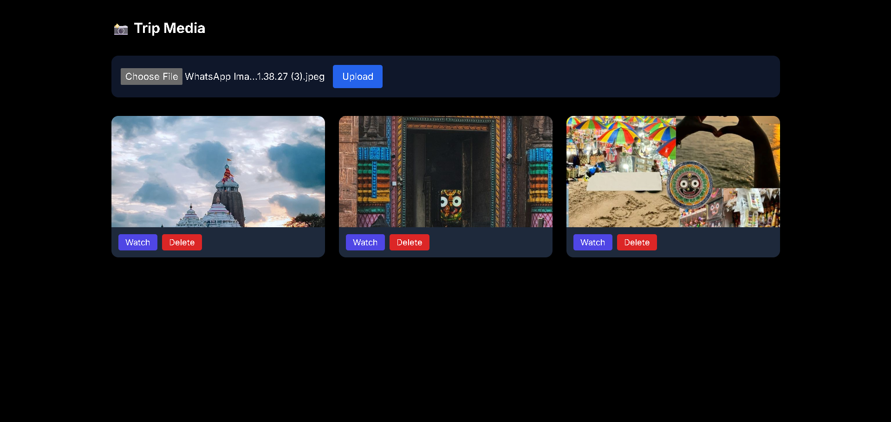

### 🤖 Chatbot
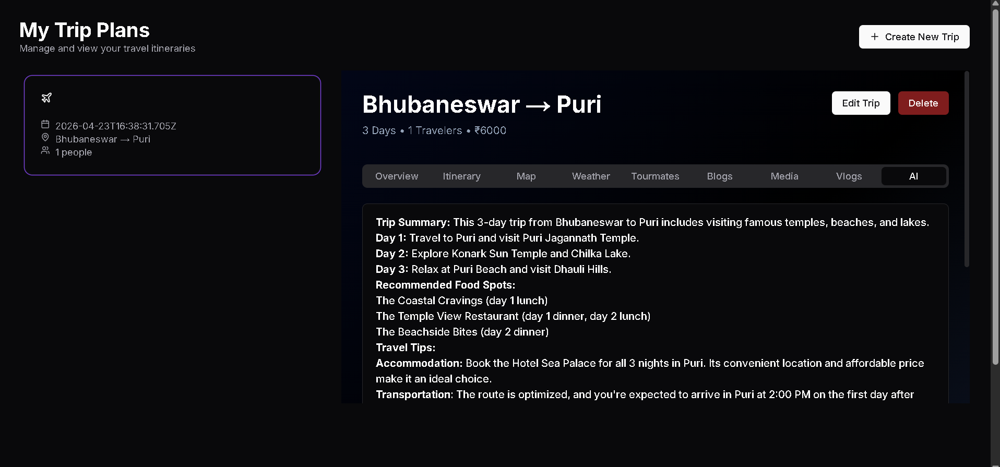

---

## 🔄 Application Flow

1. User enters trip details:
   - Origin, Destination
   - Number of days
   - Budget & preferences  

2. Frontend sends request → Backend API  

3. Backend:
   - Validates input
   - Calls Python AI server  

4. FastAPI Server:
   - Uses Groq LLM
   - Generates structured itinerary JSON  

5. Additional APIs fetch:
   - Map coordinates  
   - Weather data  
   - Nearby amenities  

6. UI displays:
   - Itinerary  
   - Budget  
   - Map  
   - Weather  
   - Blogs & Vlogs  

---

## 🧠 AI Processing

- Prompt-based itinerary generation  
- Structured JSON parsing  
- Budget normalization logic  
- Duplicate activity prevention  
- Fallback mechanism for API failures  

---

## ⚠️ Deployment Status

> ❗ Live deployment is currently unstable due to LLM response latency and cloud timeout constraints.

✔ Fully functional in local environment  
✔ Screenshots demonstrate complete working system  

---

## 🧪 Local Setup

### 1. Clone Repository

```bash
git clone https://github.com/nilimamishra2002/SmartTrip_Planner
cd project-folder
2. Install Frontend
cd travel-package
npm install
npm run dev
3. Setup Python Server
cd python-server
pip install -r requirements.txt
uvicorn app:app --reload
4. Environment Variables
Frontend (.env)
DATABASE_URL=
NEXTAUTH_SECRET=
PYTHON_SERVER_URL=http://localhost:8000
Python Server (.env)
GROQ_API_KEY=
GOOGLE_SEARCH_API_KEY=
```
## 🚧 Known Limitations
### Deployment timeout due to heavy LLM processing
### Cold start delays in Python server
### Free-tier cloud limitations

## 🔮 Future Enhancements
### Async queue-based AI processing
### Caching generated trips
### Real-time collaboration
### Mobile optimization
### Voice-based trip planning

## 👨‍💻 Contributors
### Nilima Mishra
### Jasaswini Mohanty
### Pragyan Bharati Moharana
### Reetika Mallick

## 📌 Final Note

### This project demonstrates:

### Full-stack development
### AI system integration
### Real-world API usage
### Scalable architecture design

